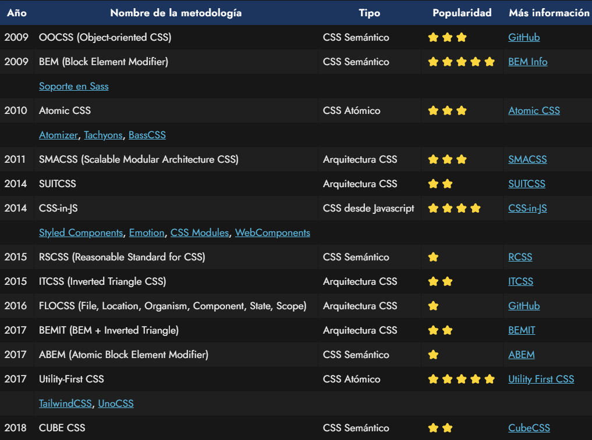

# CSS PARTE2 - Maquetación 'Smile face' responsive.
```
Para este ejercicio he querido prácticar una técnica (de las muchas que hay) que descubrí hace ya tiempo,
cuando comenzé hacer mis primeros pinitos con CSS.

Una de las veces y experimentando por mi mismo, pensé que podría usar las clases definidas en el archivo
CSS dentro de los elementos HTML (en los que los necesitara) y rápidamente vi el potencial de ello. 
Buscando información en la WEB sobre como escribir correctamente CSS y buenas prácticas, vi y comprobé 
que esta metodología ¡ya existía! y se llamaba:

ACSS (Atomic CSS) "Utility Firts".

Está técnica o metodología consiste en declarar clases que pueden ser reutilizadas allá donde las 
necesites en el HTML, con el nombre de la utilidad que realiza.

PROS:

• Un mismo CSS para todos tus proyectos.
  Se puede decir que tendrías tu propio css "librería" para cualquier proyecto web que hagas.
• Reutilización de clases.
• Poca o nula redundacia.
• Escalabilidad.

CONTRAS:

• Limpiar el archivo de estilos en cada proyecto.
  A los motores de búsqueda, SEO, etc les da igual la cantidad de clases que tengas en el html, pero a la 
  hora de cargar la página y sobretodo a la caché no... Por lo que tendrá que limpiar el css de las 
  clases no utilizadas.
• HTML "manchado" con muchas clases.
• Si es verdad que para la persona creadora del css no habría problema, porque ella le ha dado los nombres
  a las clases y se las sabe... Pero para una persona que coge el proyecto, tendría que aprendérselas,
  aún así la lógica es fácil y no llevaría mucho tiempo.

El framework Tailwind por ejemplo usa esta metodología.

```


Fuente: https://lenguajecss.com/css/calidad-de-codigo/metodologias-css/ (Manz.dev)

```
Recalcar que no soy fan de nada a la hora de escribir código, me gusta probar todas las opciones
disponibles y quedarme con la que me encuentro mas cómodo.
```
<hr>

##### jsanchez8979 - Diseño de interfaces web.
