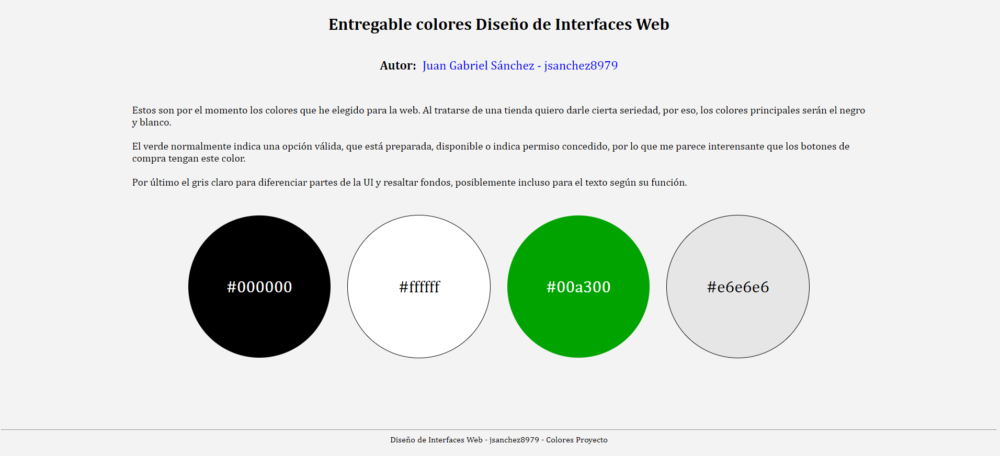

# Entregable colores Diseño de Interfaces Web

## Autor: <span style="color: #00a300;"> Juan Gabriel Sánchez - jsanchez8979 </span>

### Justificación

Estos son por el momento los colores que he elegido para la web. Al tratarse de una tienda quiero darle cierta seriedad, por eso, los colores principales serán el negro y blanco.

El verde normalmente indica una opción válida, que está preparada, disponible o indica permiso concedido, por lo que me parece interensante que los botones de compra tengan este color.

Por último el gris claro para diferenciar partes de la UI y resaltar fondos, posiblemente incluso para el texto según su función.

**Captura**



**Fichero HTML**

```
<!DOCTYPE html>
<html lang="es">
  <head>
    <meta charset="UTF-8" />
    <meta name="viewport" content="width=device-width, initial-scale=1.0" />
    <title>Colores del proyecto</title>
    <link rel="stylesheet" href="css/style.css" />
  </head>
  <body>
    <header>
      <h1>Entregable colores Diseño de Interfaces Web</h1>
      <p></p>
    </header>
    <main>
      <p class="autor">Autor: </p>
      <h2>Juan Gabriel Sánchez - jsanchez8979</h2>
      <div class="salto-de-linea"></div>
      <p class="explicacion">
        Estos son por el momento los colores que he elegido para la web. Al
        tratarse de una tienda quiero darle cierta seriedad, por eso, los
        colores principales serán el negro y blanco.
        <br />
        <br />
        El verde normalmente indica una opción válida, que está preparada,
        disponible o indica permiso concedido, por lo que me parece interensante
        que los botones de compra tengan este color.
        <br /><br />
        Por último el gris claro para diferenciar partes de la UI y resaltar
        fondos, posiblemente incluso para el texto según su función.
      </p>
      <div class="salto-de-linea"></div>
      <div class="color-uno tamano"><p>#000000</p></div>
      <div class="color-dos tamano"><p>#ffffff</p></div>
      <div class="color-tres tamano"><p>#00a300</p></div>
      <div class="color-cuatro tamano"><p>#e6e6e6</p></div>
    </main>
    <footer>
      <hr>
      <p>Diseño de Interfaces Web - jsanchez8979 - Colores Proyecto</p>
    </footer>
  </body>
</html>

```

**Fichero CSS**

```
* {
  font-family: Cambria, "Segoe UI";
}

body {
  display: flex;
  flex-direction: column;
  background-color: #f3f3f3;
}

header {
  text-align: center;
}

main {
  display: flex;
  flex-wrap: wrap;
  justify-content: center;
  align-items: center;
  height: 100%;
}

.color-uno {
  background-color: #000000;
  p {
    color: #ffffff;
    font-size: 2em;
  }
}

.color-dos {
  background-color: #ffffff;
  border: 1px solid #000000;
  p {
    color: #000000;
    font-size: 2em;
  }
}

.color-tres {
  background-color: #00a300;
  p {
    color: #ffffff;
    font-size: 2em;
  }
}

.color-cuatro {
  background-color: #e6e6e6;
  border: 1px solid #000000;
  p {
    color: #000000;
    font-size: 2em;
  }
}

.tamano {
  width: 17em;
  height: 17em;
  border-radius: 50%;
  display: flex;
  justify-content: center;
  align-items: center;
  margin: 1em;
}

.salto-de-linea {
  width: 100%;
  height: 1em;
}

.explicacion {
  width: 73.7%;
  font-size: 1.25em;
}

.autor {
  font-size: 1.5em;
  margin-right: 0.5em;
  font-weight: bold;
}

h2 {
  font-weight: normal;
  color: blue;
}

footer {
  margin-top: 7em;
  display: flex;
  justify-content: center;
  flex-wrap: wrap;
  hr {
    width: 100%;
  }
  p {
    margin: 0;
  }
}

```

### Descargas

- [index.html](index.html)
- [style.css](css/style.css)
