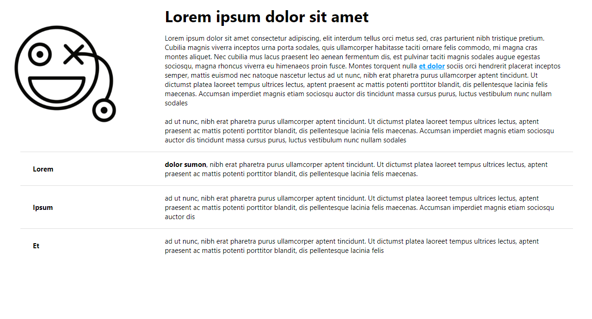

# CSS PARTE2 - Maquetación 'Smile face' responsive.

```
Para este ejercicio he usado flex y clases de utilidad para definir los estilos.
```


[Abrir ejercicio](index.html)

<hr>

##### jsanchez8979 - Diseño de interfaces web.
