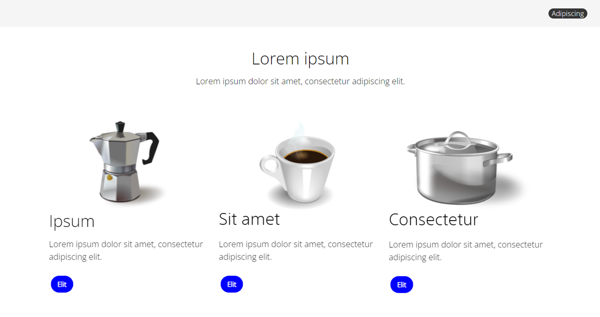

# Entregable Actividad web con imágenes svg

## Autor: <span style="color: #00a300;"> Juan Gabriel Sánchez - jsanchez8979 </span>

### Enunciado



Datos empleados:

<ul>
<li><a href='https://fonts.google.com/specimen/Open+Sans' target=_blank>https://fonts.google.com/specimen/Open+Sans (Light 300).</a></li>
<li><a href='https://pixabay.com/es/vectors/percolador-maceta-cafetera-34180/' target=_blank>Imagen cafetera</a></li>
<li><a href='https://pixabay.com/es/vectors/caf%C3%A9-taza-beber-bebida-caliente-34251/' target=_blank>Imagen taza</a></li>
<li><a href='https://pixabay.com/es/vectors/olla-de-cocci%c3%b3n-cacerola-de-la-salsa-146459/' target=_blank>Imagen cacerola</a></li>
</ul>

colores: #f1f1f1, #000, blue, #fff

Realiza lo siguiente:

<ul>
<li>Incorpora un logo a la cabecera con fondo gris.</li>
<li>¿Qué tamaño tienen las imágenes de las tres columnas?</li>

```
El tamaño de las imagenes es el mínimo que te permite la web descargartelas 640px de alto,
con un ancho variable entre ellas, un tamaño excesivo para lo que se debe mostrar en la maquetación.
Por otro lado he usado el formato svg y ajustar este tipo de elementos es complicado pero no
imposible, aún así es mejor dedicar unos minutos en pasarlas a png con un tamaño fijo.
```

<li>Analiza los tamaños incorporados a todas las imágenes. ¿Es óptimo?</li>

```
No sería óptimo porque ocupan más de lo que se va a mostrar por lo que las he redimensionado
a una altura de 200px así reducimos el tamaño de las mismas optimizando la carga de las mismas.
```

</ul>

### Descargas

-   [index.html](src/index.html)
-   [style.css](src/css/style.css)
