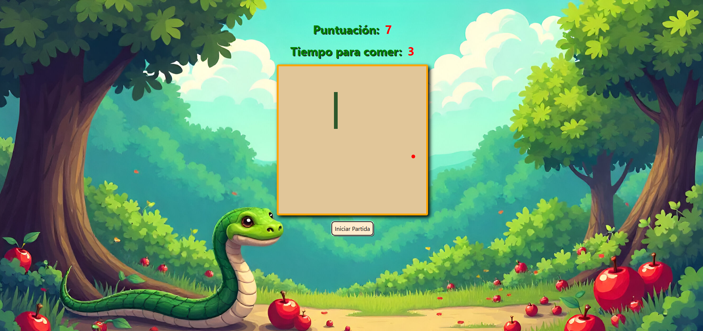

# Entregable Juego de la serpiente.

## Autor: <span style="color: #00a300;"> Juan Gabriel Sánchez - jsanchez8979 </span>

### Enunciado

Hacer el juego de de la serpiente e teniendo en cuenta lo siguiente:

<ul>
<li>Que aparezca un botón de inicio para empezar.</li>
<li>Puedes hacer que las paredes impliquen la finalización del juego (muerte de la serpiente). Existe otra opción y es que pueda atravesarlas y aparecer por el extremo opuesto. En este segundo caso, debéis tener un contador de tiempo (1 minuto) que tras finalizar, acabe la partida.</li>
<li>Que al finalizar, también aparezca un botón REINICIAR que permita volver a empezar (botón de inicio).</li>
</ul>

### Realización



```
He usado canvas para generar el programa, tenía ganas de saber como se usa y conocer algunos de sus
métodos.

Añadida una funcionalidad:
• Puntuación: Se crea una variable que hace de contador y cada vez que se come una comida se le suma
  uno, lo mostramos en le Dom usando jQuery con la opción .text sobre el elemento seleccionado.

Añadida una funcionalidad:
• Pantalla de Game Over: Se crea una función y en vez de reiniciar el juego con "location.reload()"
  se le pasa esta misma para dibujar el mensaje de Game over y la puntuación.

Añadida una mecánica de juego:
• Tiempo para comer: Se crea un intervalo de 5 segundos y cada vez que se come una comida se reseta
  a su valor inicial. En las condiciones de derrota se añade que si esta variable de intervalo
  llega a 0 se pierde la partida.

Fondo decorativo background:
• Generada con IA

Control del botón inicar partida:
• Creada una variable Boolean para que sólo se inicie el juego si esta está en false
  (juego si iniciar) cuando presionemos el botón. Esto fue un problema al inicio
	porque una vez iniciado el juego si volvias a clicar el botón aparecía otra serpiente
	tantas veces como lo hicieras.

Comida redonda en vez de cuadrada:
• Ya sabía como generar un cuadrado por la serpiente y quise saber como generar un circulo, es
  mucho mas complejo por que tienes que calcular el radio.
```

### Descargas

-   [index.html](index.html)
